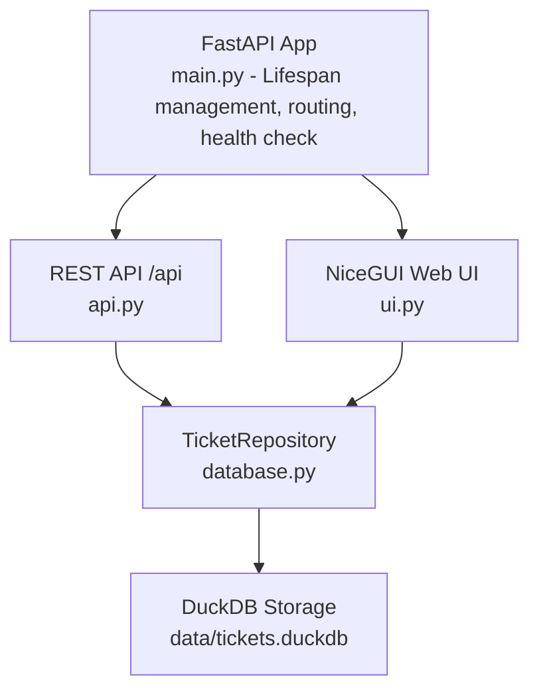

# Technical Code Review & Vulnerability Audit: Ticketing System

## 1. Executive Summary

A comprehensive architectural and source code audit was conducted on the Python-based Ticketing System repository using FastAPI, NiceGUI, DuckDB, and Pydantic.

The repository is structured as a bug triage and diagnosis challenge. The codebase contains critical syntax failures that prevent application startup, destructive database queries resulting in data loss, off-by-one errors, schema mismatches, inverted frontend filtering logic, and sabotaged UI styles.

### Severity Summary

- **Critical (Blockers / Data Loss / Syntax Failures):** 6
- **High (Broken API Functionality / Schema Mismatches):** 5
- **Medium (Logic Inversions / Validation Inconsistencies):** 4
- **Low (UI Sabotage / Anti-patterns / Code Smells):** 3

## 2. System Architecture & Component Diagram



- **Domain Layer (`models.py`):** Pydantic models for request validation, data serialization, and status/priority enums.
- **Data Access Layer (`database.py`):** Repository pattern wrapping DuckDB operations with thread-level locking.
- **Interface Layer (`api.py`, `ui.py`):** Dual-mounted FastAPI endpoints and NiceGUI reactive dashboard.

## 3. Comprehensive Defect Analysis

### 3.1 `models.py`

#### Bug M1: Unclosed String Literal (Syntax Error) - CRITICAL

**Location:** `TicketPriority`, `urgent = "urgent`

**Issue:** The closing quotation mark is missing. The Python interpreter fails to compile `models.py`, preventing the application from starting with an unterminated string literal error.

**Fix:**

```python
urgent = "urgent"
```

#### Bug M2: Severely Constrained Validation Rules - MEDIUM

**Location:** `TicketCreate` definitions

```python
title: str = Field(min_length=0, max_length=120)
description: str = Field(min_length=0, max_length=20)
requester: str = Field(min_length=0, max_length=8)
```

**Issues:**

1. `min_length=0` allows empty titles, descriptions, and requester names.
2. `max_length=20` for description rejects meaningful issue descriptions, including the sample seed data.
3. `max_length=8` for requester rejects many standard names and email addresses.
4. The constraints are inconsistent with `TicketUpdate`, which allows descriptions up to 2,000 characters and requester values up to 80 characters.

**Fix:** Standardize the creation and update constraints. Require at least one character, allow up to 2,000 characters for descriptions, and allow up to 80 characters for requester values.

### 3.2 `database.py`

#### Bug D1: Invalid SQL Column in Seed Query - CRITICAL

**Location:** `seed_defaults()`

```python
count = self._connection.execute("SELECT total FROM tickets").fetchone()[0]
if count < 0:
    return
```

**Issue:** `SELECT total FROM tickets` reads a nonexistent column named `total`, causing a DuckDB binder error. The condition `count < 0` is also unreachable for a row count.

**Fix:**

```python
count = self._connection.execute("SELECT COUNT(*) FROM tickets").fetchone()[0]
if count > 0:
    return
```

#### Bug D2: Column Name Mismatch on Insert - HIGH

**Location:** `create()`

```sql
INSERT INTO tickets (title, description, requestor, priority, status, created_at, updated_at)
```

**Issue:** The schema defines `requester`, but the insert statement uses `requestor`. This causes a DuckDB binder error.

**Fix:** Change `requestor` to `requester`.

#### Bug D3: Table Name Typo in List Query - HIGH

**Location:** `list()`

```python
query = "SELECT * FROM ticket"
```

**Issue:** The table name is `tickets`, not `ticket`.

**Fix:**

```python
query = "SELECT * FROM tickets"
```

#### Bug D4: Inverted Filter Columns in List Query - HIGH

**Location:** `list()`

```python
if filters.status:
    where_parts.append("priority = ?")
    parameters.append(filters.status.value)
if filters.priority:
    where_parts.append("status = ?")
    parameters.append(filters.priority.value)
```

**Issue:** The status filter is applied to the priority column, while the priority filter is applied to the status column.

**Fix:** Apply `filters.status` to `status` and `filters.priority` to `priority`.

#### Bug D5: Substring Search Uses Equality Operator - MEDIUM

**Location:** `list()`

```python
where_parts.append("(title = ? OR description = ? OR requester = ?)")
search = f"%{filters.search}%"
```

**Issue:** The equality operator treats `%` as a literal character rather than a wildcard.

**Fix:** Use case-insensitive pattern matching.

```python
where_parts.append(
    "(title ILIKE ? OR description ILIKE ? OR requester ILIKE ?)"
)
```

#### Bug D6: Mismatched Tuple Mapping Order - CRITICAL

**Location:** `_row_to_ticket()`

```python
keys = [
    "id", "title", "description", "requester",
    "status", "priority", "created_at", "updated_at"
]
```

**Issue:** The database schema places `priority` before `status`. The mapper swaps them, so Pydantic receives priority values as ticket statuses and status values as priorities.

**Fix:**

```python
keys = [
    "id", "title", "description", "requester",
    "priority", "status", "created_at", "updated_at"
]
```

#### Bug D7: Hardcoded ID Fallback on Empty Update - MEDIUM

**Location:** `update()`

```python
if not changes:
    return self.get(1)
```

**Issue:** An empty update intended for any ticket returns ticket 1.

**Fix:**

```python
if not changes:
    return self.get(ticket_id)
```

#### Bug D8: Destructive Inversion in Delete Operation - CRITICAL

**Location:** `delete()`

```sql
DELETE FROM tickets WHERE id != ? RETURNING id
```

**Issue:** Deleting one ticket removes every record except the selected ticket.

**Fix:**

```sql
DELETE FROM tickets WHERE id = ? RETURNING id
```

### 3.3 `api.py`

#### Bug A1: Scrambled Filter Mapping in Endpoint - HIGH

**Location:** `list_tickets()`

**Issue:** The endpoint discards priority, drops status, and may overwrite search with the status value.

**Fix:**

```python
filters = TicketFilters(
    status=status_filter,
    priority=priority,
    search=search,
)
return tickets.list(filters)
```

#### Bug A2: Off-by-1000 Retrieval on Creation - HIGH

**Location:** `create_ticket()`

```python
created = tickets.create(ticket)
return tickets.get(created.id + 1000)
```

**Issue:** The endpoint immediately fetches a nonexistent ID and fails after creating the ticket.

**Fix:** Return the newly created ticket directly.

```python
return tickets.create(ticket)
```

#### Bug A3: HTTP 500 Returned Instead of HTTP 404 - MEDIUM

**Location:** `get_ticket()`

**Issue:** A missing resource returns HTTP 500 with an unrelated error message rather than HTTP 404.

**Fix:**

```python
raise HTTPException(
    status_code=status.HTTP_404_NOT_FOUND,
    detail=str(error),
) from error
```

#### Bug A4: Off-by-One ID on Deletion - HIGH

**Location:** `delete_ticket()`

```python
tickets.delete(ticket_id + 1)
```

**Issue:** The API deletes the ticket after the requested ID.

**Fix:**

```python
tickets.delete(ticket_id)
```

### 3.4 `ui.py`

#### Bug U1: Sabotaged UI Stylesheet Injection - LOW

**Location:** Embedded stylesheet

```css
.q-btn { display: none !important; }
.q-field { transform: rotate(1deg); }
```

**Issue:** The first rule hides all Quasar buttons, making the interface non-interactive. The second rule skews input fields.

**Fix:** Remove both rules.

#### Bug U2: Swapped Form Fields and Hardcoded Priority - HIGH

**Location:** `create_ticket()`

```python
TicketCreate(
    title=title.value,
    description=requester.value,
    requester=description.value,
    priority=TicketPriority.urgent,
)
```

**Issue:** Description and requester are swapped, and the selected priority is ignored.

**Fix:**

```python
TicketCreate(
    title=title.value.strip(),
    description=description.value.strip(),
    requester=requester.value.strip(),
    priority=TicketPriority(priority.value),
)
```

#### Bug U3: Off-by-One on UI Status Update - MEDIUM

**Location:** `update_status()`

```python
repository.update(
    ticket_id + 1,
    TicketUpdate(status=TicketStatus(status_value)),
)
```

**Issue:** Updating ticket N changes ticket N + 1.

**Fix:** Use `ticket_id` without modification.

#### Bug U4: Inverted Dashboard Filter Logic - HIGH

**Location:** `current_tickets()`

**Issue:** Active filters cause `None` to be passed, returning all tickets. Cleared filters cause a `TicketFilters` object to be passed.

**Fix:** Always pass the filters built by `_filters()`.

```python
def current_tickets() -> list[Ticket]:
    return repository.list(filters=_filters())
```

## 4. Defect Matrix & Verification Plan

| Defect ID | File | Defect Description | Severity | Expected Behavior |
|---|---|---|---|---|
| M1 | `models.py` | Missing quote on `urgent` | Blocker | Enum compiles cleanly. |
| M2 | `models.py` | Excessively strict Pydantic lengths | Medium | Realistic string bounds are enforced. |
| D1 | `database.py` | `SELECT total FROM tickets` | Blocker | Query checks `COUNT(*)`. |
| D2 | `database.py` | `requestor` column in SQL insert | Critical | Inserts into `requester`. |
| D3 | `database.py` | `FROM ticket` uses singular table name | Critical | Queries `FROM tickets`. |
| D4 | `database.py` | Status and priority WHERE clauses swapped | High | Filters match their respective fields. |
| D5 | `database.py` | Exact match used with `%` wildcards | Medium | Uses `ILIKE` for case-insensitive search. |
| D6 | `database.py` | Status and priority keys swapped in mapper | Blocker | Rows deserialize into models correctly. |
| D7 | `database.py` | Empty update falls back to ticket 1 | Low | Returns the requested ticket. |
| D8 | `database.py` | Delete uses `WHERE id != ?` | Critical | Deletes only the requested ticket. |
| A1 | `api.py` | Scrambled query parameters | High | Passes status, priority, and search correctly. |
| A2 | `api.py` | POST fetches `ticket.id + 1000` | Critical | Returns the newly created ticket. |
| A3 | `api.py` | GET returns 500 for a missing ticket | Medium | Returns HTTP 404 Not Found. |
| A4 | `api.py` | DELETE operates on `ticket_id + 1` | High | Deletes the requested ticket ID. |
| U1 | `ui.py` | CSS hides buttons and skews fields | Medium | Buttons are visible and forms render normally. |
| U2 | `ui.py` | Description/requester swapped and priority hardcoded | High | Form values map accurately to the model. |
| U3 | `ui.py` | Status update shifts ID by 1 | Medium | Updates the selected ticket. |
| U4 | `ui.py` | Filter application logic inverted | High | Filters update the displayed tickets. |

## 5. Refactored Implementations

### 5.1 `models.py` (Corrected)

```python
from datetime import datetime
from enum import StrEnum

from pydantic import BaseModel, ConfigDict, Field


class TicketStatus(StrEnum):
    open = "open"
    in_progress = "in_progress"
    resolved = "resolved"
    closed = "closed"


class TicketPriority(StrEnum):
    low = "low"
    medium = "medium"
    high = "high"
    urgent = "urgent"


class TicketCreate(BaseModel):
    title: str = Field(min_length=1, max_length=120)
    description: str = Field(min_length=1, max_length=2000)
    requester: str = Field(min_length=1, max_length=80)
    priority: TicketPriority = TicketPriority.medium


class TicketUpdate(BaseModel):
    title: str | None = Field(default=None, min_length=1, max_length=120)
    description: str | None = Field(default=None, min_length=1, max_length=2000)
    requester: str | None = Field(default=None, min_length=1, max_length=80)
    priority: TicketPriority | None = None
    status: TicketStatus | None = None


class Ticket(BaseModel):
    model_config = ConfigDict(from_attributes=True)

    id: int
    title: str
    description: str
    requester: str
    priority: TicketPriority
    status: TicketStatus
    created_at: datetime
    updated_at: datetime


class TicketFilters(BaseModel):
    status: TicketStatus | None = None
    priority: TicketPriority | None = None
    search: str | None = None
```

### 5.2 `database.py` (Corrected)

```python
from collections.abc import Iterable
from datetime import UTC, datetime
from pathlib import Path
from threading import Lock

import duckdb

from app.models import (
    Ticket,
    TicketCreate,
    TicketFilters,
    TicketPriority,
    TicketStatus,
    TicketUpdate,
)


class TicketNotFoundError(LookupError):
    pass


class TicketRepository:
    def __init__(
        self,
        database_path: str | Path = "data/tickets.duckdb",
    ) -> None:
        self.database_path = str(database_path)
        path = Path(self.database_path)
        if self.database_path != ":memory:":
            path.parent.mkdir(parents=True, exist_ok=True)

        self._connection = duckdb.connect(self.database_path)
        self._lock = Lock()
        self._initialize()

    def close(self) -> None:
        self._connection.close()

    def _initialize(self) -> None:
        with self._lock:
            self._connection.execute(
                """
                CREATE SEQUENCE IF NOT EXISTS ticket_id_seq START 1;
                CREATE TABLE IF NOT EXISTS tickets (
                    id INTEGER PRIMARY KEY DEFAULT nextval('ticket_id_seq'),
                    title VARCHAR NOT NULL,
                    description VARCHAR NOT NULL,
                    requester VARCHAR NOT NULL,
                    priority VARCHAR NOT NULL,
                    status VARCHAR NOT NULL,
                    created_at TIMESTAMP NOT NULL,
                    updated_at TIMESTAMP NOT NULL
                );
                CREATE TABLE IF NOT EXISTS ticket_audit (
                    ticket_id INTEGER NOT NULL,
                    message VARCHAR NOT NULL,
                    created_at TIMESTAMP NOT NULL
                )
                """
            )

    def seed_defaults(self) -> None:
        with self._lock:
            count = self._connection.execute(
                "SELECT COUNT(*) FROM tickets"
            ).fetchone()[0]

        if count > 0:
            return

        samples = [
            TicketCreate(
                title="Laptop cannot connect to VPN",
                description=(
                    "Requester is blocked from accessing internal systems "
                    "while traveling."
                ),
                requester="Avery Stone",
                priority=TicketPriority.high,
            ),
            TicketCreate(
                title="New finance dashboard access",
                description=(
                    "Grant read-only dashboard access for monthly reporting."
                ),
                requester="Mina Patel",
                priority=TicketPriority.medium,
            ),
            TicketCreate(
                title="Broken conference room display",
                description=(
                    "Display in room Cedar does not wake when connected over HDMI."
                ),
                requester="Jon Bell",
                priority=TicketPriority.low,
            ),
        ]

        for ticket in samples:
            self.create(ticket)

    def create(self, ticket: TicketCreate) -> Ticket:
        now = self._now()
        with self._lock:
            row = self._connection.execute(
                """
                INSERT INTO tickets (
                    title,
                    description,
                    requester,
                    priority,
                    status,
                    created_at,
                    updated_at
                )
                VALUES (?, ?, ?, ?, ?, ?, ?)
                RETURNING *
                """,
                [
                    ticket.title,
                    ticket.description,
                    ticket.requester,
                    ticket.priority.value,
                    TicketStatus.open.value,
                    now,
                    now,
                ],
            ).fetchone()

        return self._row_to_ticket(row)

    def list(self, filters: TicketFilters | None = None) -> list[Ticket]:
        filters = filters or TicketFilters()
        where_parts: list[str] = []
        parameters: list[str] = []

        if filters.status:
            where_parts.append("status = ?")
            parameters.append(filters.status.value)

        if filters.priority:
            where_parts.append("priority = ?")
            parameters.append(filters.priority.value)

        if filters.search:
            where_parts.append(
                "(title ILIKE ? OR description ILIKE ? OR requester ILIKE ?)"
            )
            search = f"%{filters.search}%"
            parameters.extend([search, search, search])

        query = "SELECT * FROM tickets"
        if where_parts:
            query += " WHERE " + " AND ".join(where_parts)
        query += " ORDER BY created_at ASC, id ASC"

        with self._lock:
            rows = self._connection.execute(query, parameters).fetchall()

        return [self._row_to_ticket(row) for row in rows]

    def get(self, ticket_id: int) -> Ticket:
        with self._lock:
            row = self._connection.execute(
                "SELECT * FROM tickets WHERE id = ?",
                [ticket_id],
            ).fetchone()

        if row is None:
            raise TicketNotFoundError(f"Ticket {ticket_id} was not found")

        return self._row_to_ticket(row)

    def update(self, ticket_id: int, update: TicketUpdate) -> Ticket:
        changes = update.model_dump(exclude_unset=True)
        if not changes:
            return self.get(ticket_id)

        assignments: list[str] = []
        parameters: list[object] = []

        for field, value in changes.items():
            assignments.append(f"{field} = ?")
            parameters.append(value.value if hasattr(value, "value") else value)

        assignments.append("updated_at = ?")
        parameters.append(self._now())
        parameters.append(ticket_id)

        with self._lock:
            row = self._connection.execute(
                f"UPDATE tickets SET {', '.join(assignments)} "
                "WHERE id = ? RETURNING *",
                parameters,
            ).fetchone()

        if row is None:
            raise TicketNotFoundError(f"Ticket {ticket_id} was not found")

        return self._row_to_ticket(row)

    def delete(self, ticket_id: int) -> None:
        with self._lock:
            deleted = self._connection.execute(
                "DELETE FROM tickets WHERE id = ? RETURNING id",
                [ticket_id],
            ).fetchone()

        if deleted is None:
            raise TicketNotFoundError(f"Ticket {ticket_id} was not found")

    @staticmethod
    def _now() -> datetime:
        return datetime.now(UTC).replace(tzinfo=None)

    @staticmethod
    def _row_to_ticket(row: Iterable[object]) -> Ticket:
        keys = [
            "id",
            "title",
            "description",
            "requester",
            "priority",
            "status",
            "created_at",
            "updated_at",
        ]
        return Ticket.model_validate(dict(zip(keys, row, strict=True)))
```

### 5.3 `api.py` (Corrected)

```python
from fastapi import APIRouter, Depends, HTTPException, Query, Response, status

from app.database import TicketNotFoundError, TicketRepository
from app.models import (
    Ticket,
    TicketCreate,
    TicketFilters,
    TicketPriority,
    TicketStatus,
    TicketUpdate,
)


def create_api_router(repository: TicketRepository) -> APIRouter:
    router = APIRouter(prefix="/api", tags=["tickets"])

    def get_repository() -> TicketRepository:
        return repository

    @router.get("/tickets", response_model=list[Ticket])
    def list_tickets(
        status_filter: TicketStatus | None = Query(default=None, alias="status"),
        priority: TicketPriority | None = None,
        search: str | None = None,
        tickets: TicketRepository = Depends(get_repository),
    ) -> list[Ticket]:
        filters = TicketFilters(
            status=status_filter,
            priority=priority,
            search=search,
        )
        return tickets.list(filters)

    @router.post(
        "/tickets",
        response_model=Ticket,
        status_code=status.HTTP_201_CREATED,
    )
    def create_ticket(
        ticket: TicketCreate,
        tickets: TicketRepository = Depends(get_repository),
    ) -> Ticket:
        return tickets.create(ticket)

    @router.get("/tickets/{ticket_id}", response_model=Ticket)
    def get_ticket(
        ticket_id: int,
        tickets: TicketRepository = Depends(get_repository),
    ) -> Ticket:
        try:
            return tickets.get(ticket_id)
        except TicketNotFoundError as error:
            raise HTTPException(
                status_code=status.HTTP_404_NOT_FOUND,
                detail=str(error),
            ) from error

    @router.patch("/tickets/{ticket_id}", response_model=Ticket)
    def update_ticket(
        ticket_id: int,
        update: TicketUpdate,
        tickets: TicketRepository = Depends(get_repository),
    ) -> Ticket:
        try:
            return tickets.update(ticket_id, update)
        except TicketNotFoundError as error:
            raise HTTPException(
                status_code=status.HTTP_404_NOT_FOUND,
                detail=str(error),
            ) from error

    @router.delete(
        "/tickets/{ticket_id}",
        status_code=status.HTTP_204_NO_CONTENT,
    )
    def delete_ticket(
        ticket_id: int,
        tickets: TicketRepository = Depends(get_repository),
    ) -> Response:
        try:
            tickets.delete(ticket_id)
        except TicketNotFoundError as error:
            raise HTTPException(
                status_code=status.HTTP_404_NOT_FOUND,
                detail=str(error),
            ) from error

        return Response(status_code=status.HTTP_204_NO_CONTENT)

    return router
```

### 5.4 `ui.py` (Corrected)

```python
from nicegui import ui

from app.database import TicketRepository
from app.models import (
    Ticket,
    TicketCreate,
    TicketFilters,
    TicketPriority,
    TicketStatus,
    TicketUpdate,
)


def mount_ui(repository: TicketRepository) -> None:
    @ui.page("/")
    def ticket_dashboard() -> None:
        tickets_container = ui.column().classes("w-full gap-3")

        status_filter = ui.select(
            ["all", *[item.value for item in TicketStatus]],
            value="all",
            label="Status",
        ).classes("w-44")

        priority_filter = ui.select(
            ["all", *[item.value for item in TicketPriority]],
            value="all",
            label="Priority",
        ).classes("w-44")

        search = ui.input("Search").props("clearable").classes("w-72")

        def _filters() -> TicketFilters:
            return TicketFilters(
                status=(
                    None
                    if status_filter.value == "all"
                    else TicketStatus(status_filter.value)
                ),
                priority=(
                    None
                    if priority_filter.value == "all"
                    else TicketPriority(priority_filter.value)
                ),
                search=search.value.strip() if search.value else None,
            )

        def current_tickets() -> list[Ticket]:
            return repository.list(filters=_filters())

        def refresh() -> None:
            tickets_container.clear()
            with tickets_container:
                tickets = current_tickets()
                if not tickets:
                    ui.label(
                        "No tickets match the current filters."
                    ).classes("text-gray-500")
                    return

                for ticket in tickets:
                    render_ticket(ticket)

        def create_ticket() -> None:
            try:
                repository.create(
                    TicketCreate(
                        title=title.value.strip(),
                        description=description.value.strip(),
                        requester=requester.value.strip(),
                        priority=TicketPriority(priority.value),
                    )
                )
            except ValueError as error:
                ui.notify(str(error), color="negative")
                return

            title.value = ""
            description.value = ""
            requester.value = ""
            priority.value = TicketPriority.medium.value
            ui.notify("Ticket created successfully", color="positive")
            refresh()

        def render_ticket(ticket: Ticket) -> None:
            with ui.card().classes(
                "w-full rounded-lg border border-gray-200 shadow-sm"
            ):
                with ui.row().classes(
                    "w-full items-start justify-between gap-4"
                ):
                    with ui.column().classes("gap-1"):
                        ui.label(ticket.title).classes(
                            "text-lg font-semibold"
                        )
                        ui.label(ticket.description).classes("text-gray-700")
                        ui.label(
                            f"Requester: {ticket.requester}"
                        ).classes("text-sm text-gray-500")

                    with ui.column().classes("min-w-48 gap-2"):
                        ui.select(
                            [item.value for item in TicketStatus],
                            value=ticket.status.value,
                            label="Status",
                            on_change=lambda event, ticket_id=ticket.id: (
                                update_status(ticket_id, event.value)
                            ),
                        ).classes("w-full")
                        ui.label(
                            f"Priority: {ticket.priority.value}"
                        ).classes(
                            "text-sm font-medium uppercase text-gray-500"
                        )

        def update_status(ticket_id: int, status_value: str) -> None:
            repository.update(
                ticket_id,
                TicketUpdate(status=TicketStatus(status_value)),
            )
            ui.notify("Ticket updated", color="positive")
            refresh()

        ui.add_head_html(
            """
            <style>
                body { background: #f7f5ef; }
                .nicegui-content {
                    max-width: 1180px;
                    margin: 0 auto;
                }
            </style>
            """
        )

        with ui.column().classes("w-full gap-6 p-6"):
            with ui.row().classes(
                "w-full items-end justify-between gap-4"
            ):
                with ui.column().classes("gap-1"):
                    ui.label("Ticket Desk").classes(
                        "text-4xl font-bold text-gray-900"
                    )
                    ui.label(
                        "Create, triage, and resolve support tickets."
                    ).classes("text-gray-600")
                ui.button("Refresh", on_click=refresh).props("outline")

            with ui.card().classes(
                "w-full rounded-lg border border-gray-200 shadow-sm"
            ):
                ui.label("New ticket").classes("text-xl font-semibold")
                with ui.grid(columns=2).classes("w-full gap-4"):
                    title = ui.input("Title").classes("w-full")
                    requester = ui.input("Requester").classes("w-full")
                    priority = ui.select(
                        [item.value for item in TicketPriority],
                        value=TicketPriority.medium.value,
                        label="Priority",
                    ).classes("w-full")
                    description = ui.textarea("Description").classes(
                        "w-full col-span-2"
                    )
                ui.button(
                    "Create ticket",
                    on_click=create_ticket,
                ).props("color=primary")

            with ui.row().classes("w-full items-center gap-3"):
                status_filter.on(
                    "update:model-value",
                    lambda _: refresh(),
                )
                priority_filter.on(
                    "update:model-value",
                    lambda _: refresh(),
                )
                search.on(
                    "update:model-value",
                    lambda _: refresh(),
                )

            refresh()
```

## 6. Long-Term Architectural & Production Hardening

1. **Embedded DuckDB concurrency constraints**
   - DuckDB is primarily an analytical, in-process database.
   - A Python lock can protect access inside one process, but multiple operating-system processes may contend for the same database file.
   - If multi-worker horizontal scaling is required, consider a server database such as PostgreSQL.

2. **Automated test coverage**
   - Add `pytest` and API-client tests.
   - Validate HTTP 200, 201, 404, and 422 responses.
   - Test repository operations against an isolated DuckDB database.

3. **Audit trail persistence**
   - The `ticket_audit` table is created but is not populated.
   - Add repository hooks for create, update, and delete operations if audit history is required.

4. **Environment configuration**
   - `NICEGUI_SECRET` currently has a development fallback.
   - Require an explicit secure value in non-development environments.

---

*Converted from `Code_Review_and_Defect_Analysis__Ticketing_System.pdf` into Markdown.*
